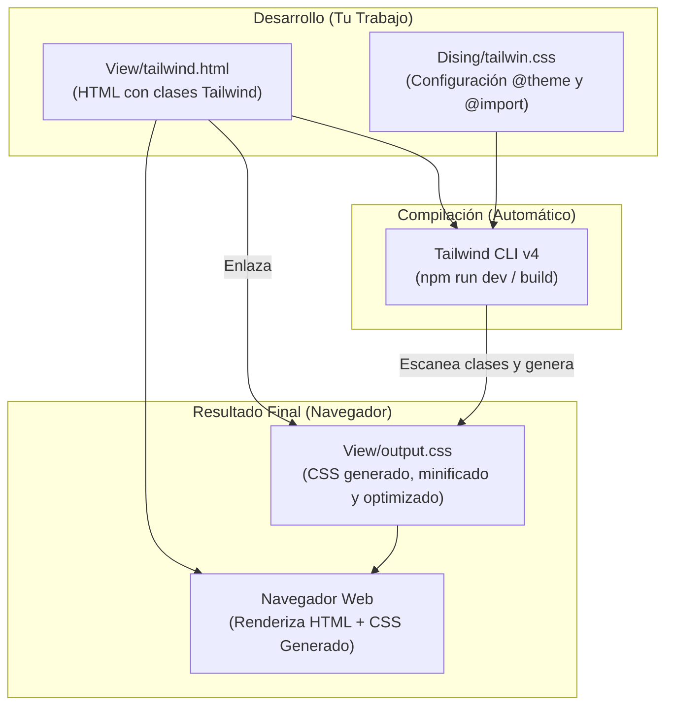

# Proyecto Web – Integración Figma + TailwindCSS

## Introducción

Para el desarrollo de este proyecto, seleccioné una plantilla de **Figma** creada por **Mohammed Jawed** como base para el diseño inicial.
El archivo original puede consultarse en el siguiente enlace:

[Bean Scene Coffee Landingpage](https://www.figma.com/community/file/1201418433329014860)

A partir de esta plantilla, implementé el **MCP de Figma** y realicé diversos cambios y ajustes para adaptar el diseño al proceso de desarrollo y darle una identidad propia.

---

## Retos durante el desarrollo

Uno de los principales desafíos surgió al utilizar **FNM (Fast Node Manager)** como gestor de versiones de Node.js. Debido a la gestión de versiones, se presentaron inconvenientes para vincular correctamente los comandos con el IDE, ya que no se reconocían:

- `fnm`
- `node`
- `npx`

La solución consistió en **definir explícitamente la ruta de ejecución** y agregar el **token de la API de Figma**, lo que permitió el correcto funcionamiento del MCP.

A continuación, se muestra la estructura utilizada para la configuración del MCP:

```json
{
  "mcpServers": {
    "Framelink MCP for Figma": {
      "command": "fnm",
      "args": [
        "exec",
        "--using=default",
        "--",
        "npx",
        "-y",
        "figma-developer-mcp",
        "--figma-api-key=TU_FIGMA_API_KEY_AQUI"
      ]
    }
  }
}
```

---

## Organización del Proyecto

### Carpeta `Dising`
Inicialmente, una vez resuelta la configuración, se trabajó en la carpeta **`Dising`** utilizando **CSS Vanilla**.
El objetivo de esta etapa fue explorar la estructura y validar el diseño base antes de migrar a herramientas más avanzadas. Aquí también se establecieron las primeras bases del **diseño responsivo**.

### Carpeta `View`
En la carpeta **`View`** se llevó a cabo el desarrollo principal de la aplicación, implementando **TailwindCSS** para agilizar el estilizado y asegurar una **responsividad** robusta.

Se realizaron modificaciones significativas respecto al diseño original de Figma para diferenciar visualmente el proyecto.

Para la interacción, se utilizó **JavaScript Vanilla** exclusivamente para implementar un efecto **parallax**, manteniendo el proyecto ligero y optimizado.

---

## Flujo de Desarrollo

El siguiente diagrama ilustra el proceso de desarrollo, compilación y renderizado final en el navegador:



---

## Tecnologías Utilizadas

- **HTML5**: Estructura semántica.
- **CSS3**: Estilos base y personalizados.
- **TailwindCSS v4**: Framework de utilidades para diseño rápido y responsivo.
- **JavaScript (Vanilla)**: Lógica para efectos visuales (Parallax).
- **Figma**: Diseño y prototipado (MCP integration).
- **Node.js**: Entorno de ejecución.
- **FNM (Fast Node Manager)**: Gestión de versiones de Node.js.
