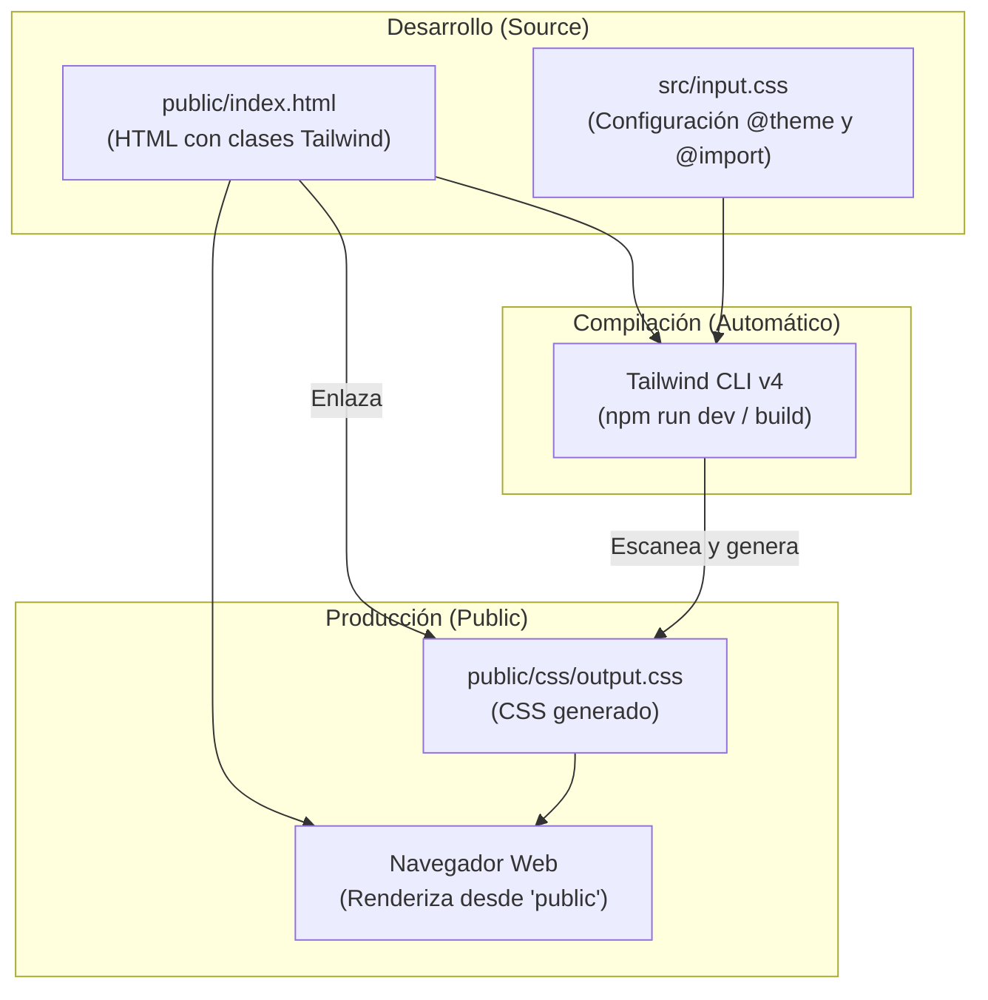

# Proyecto Web – Integración Figma + TailwindCSS

## Introducción

Para el desarrollo de este proyecto, seleccioné una plantilla de **Figma** creada por **Mohammed Jawed** como base para el diseño inicial.
El archivo original puede consultarse en el siguiente enlace:

[Bean Scene Coffee Landingpage](https://www.figma.com/community/file/1201418433329014860)

A partir de esta plantilla, implementé el **MCP de Figma** y realicé diversos cambios y ajustes para adaptar el diseño al proceso de desarrollo y darle una identidad propia.

---

## Organización del Proyecto (Simplificada)

Se ha simplificado la estructura del proyecto para facilitar el despliegue y el mantenimiento, consolidando los archivos finales en la carpeta `public`.

### Carpeta `public`
Contiene todos los archivos necesarios para el despliegue en producción (Netlify):
- `index.html`: Estructura principal con clases de Tailwind.
- `css/output.css`: Hoja de estilos generada y minificada.
- `img/`: Recursos gráficos optimizados.

### Carpeta `src`
Contiene los archivos fuente de estilos:
- `input.css`: Configuración base de Tailwind y directivas `@theme`.

Para la interacción, se utilizó **JavaScript Vanilla** exclusivamente para implementar un efecto **parallax**, manteniendo el proyecto ligero y optimizado.

---

## Flujo de Desarrollo

El siguiente diagrama ilustra el proceso de desarrollo, compilación y renderizado final en el navegador:

---

## Tecnologías Utilizadas

- **HTML5**: Estructura semántica.
- **CSS3**: Estilos base y personalizados.
- **TailwindCSS v4**: Framework de utilidades para diseño rápido y responsivo.
- **JavaScript (Vanilla)**: Lógica para efectos visuales (Parallax).
- **Figma**: Diseño y prototipado (MCP integration).
- **Node.js**: Entorno de ejecución.
- **Netlify**: Plataforma de despliegue continuo.
